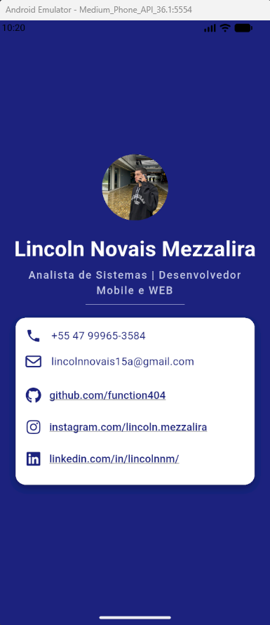

# Cartão de Visita Digital - Flutter 📱

**Faculdade Senac Joinville** **Curso:** Análise e Desenvolvimento de Sistemas - 5ª Fase (2026/1)  
**Disciplina:** Desenvolvimento para Dispositivos Móveis  
**Aluno:** Lincoln Novais Mezzalira

## 📋 Sobre o Projeto
Este é o meu primeiro aplicativo Flutter, desenvolvido como Atividade Prática da Aula 5. O projeto consiste em um Cartão de Visita Digital interativo que exibe minhas informações profissionais de forma organizada e estilizada.

## ✨ Funcionalidades e Widgets Utilizados
A interface foi construída seguindo o conceito de árvore de widgets, utilizando componentes baseados na documentação oficial:
* `StatelessWidget` para a estrutura estática.
* `Column` e `Row` para o alinhamento e organização do layout.
* `Container` com propriedades avançadas (`padding`, `margin`).
* `TextStyle` para tipografia customizada.
* **Bônus Implementados:** `CircleAvatar` para foto de perfil, ícones do Material Design (`Icon`), bordas arredondadas (`borderRadius`) e sombras (`boxShadow`).

## 🖼️ Screenshots


## 🚀 Como Executar o Projeto
1. Certifique-se de ter o [Flutter SDK](https://flutter.dev/docs/get-started/install) instalado.
2. Clone este repositório:
```bash
git clone git@github.com:function404/myappdart_.git
```
3. Abra a pasta do projeto no seu editor de código preferido (VS Code ou Android Studio).
4. Restaure as dependências do Flutter:
```bash
flutter pub get
```
5. Execute o aplicativo em um emulador ou dispositivo físico:
```Bash
flutter run
```
